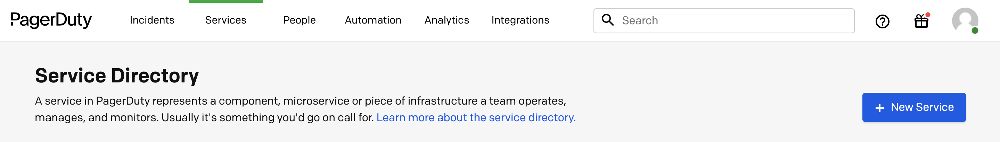
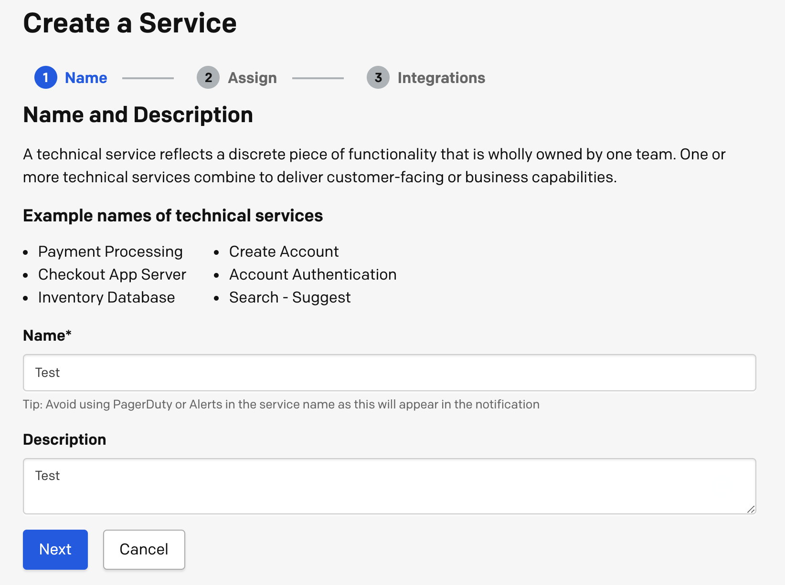
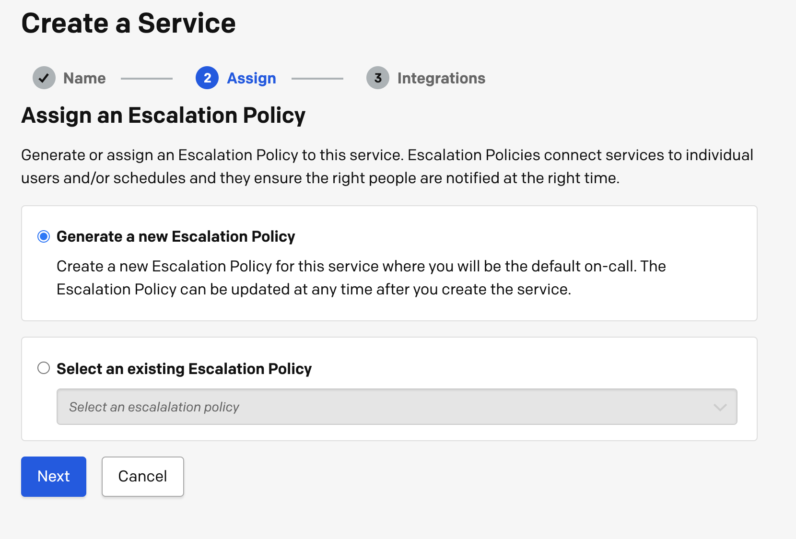
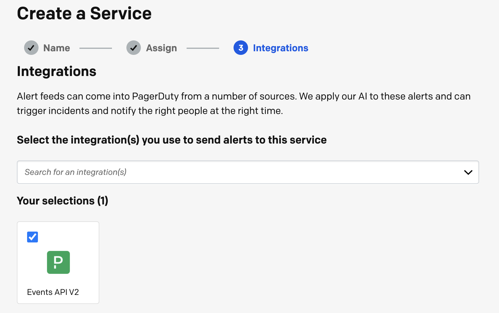
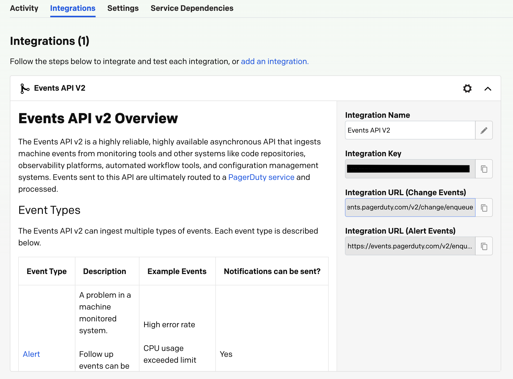
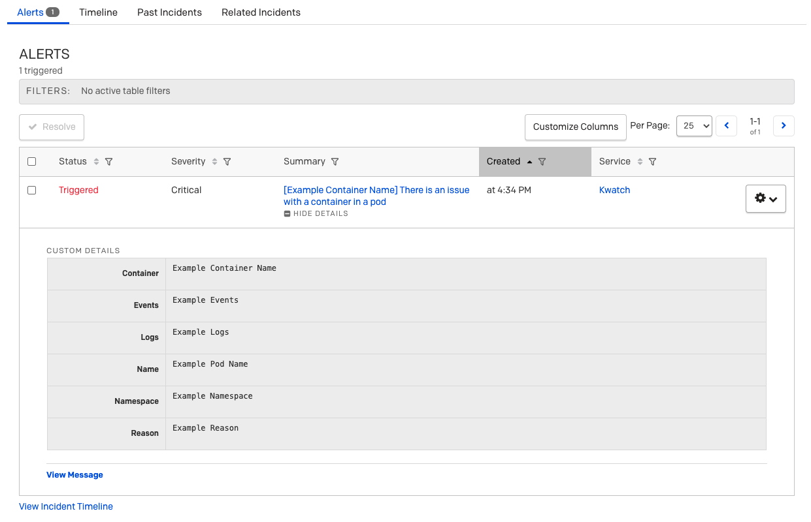

In this article you will learn how to setup and deploy kwatch in your Kubernetes (K8s) cluster to monitor and receive real time crash alerts through PagerDuty
<!--truncate-->

### Step 1: Create a new service

### Step 2: Give your service a Name and a Description

### Step 3: Add an [Escalation Policy](https://support.pagerduty.com/docs/escalation-policies)

### Step 4: Make sure to add the [Events API V2](https://developer.pagerduty.com/api-reference/b3A6Mjc0ODI2Nw-send-an-event-to-pager-duty) Integration

### Step 5: Navigate to your service and copy the Integration Key

### Step 6: Get the configuration template
```shell
curl  -L https://raw.githubusercontent.com/abahmed/kwatch/v0.3.0/deploy/config.yaml -o config.yaml
```
### Step 7: Edit `config.yaml` file and add the Integration Key
```yml
apiVersion: v1
kind: Namespace
metadata:
  name: kwatch
---
apiVersion: v1
kind: ConfigMap
metadata:
  name: kwatch
  namespace: kwatch
data:
  config.yaml: |
    alert:
      pagerduty:
        integrationKey: <integration_key>
```
### Step 8: Apply the configuration
```shell
kubectl apply -f config.yaml
```
### Step 8: Deploy kwatch
```shell
kubectl apply -f https://raw.githubusercontent.com/abahmed/kwatch/v0.3.0/deploy/deploy.yaml
```

**You will now start receiving PagerDuty alerts whenever there is a pod crash in your Kubernetes (K8s) cluster!**


_If you like kwatch, give it a star on [GitHub](https://github.com/abahmed/kwatch)_!